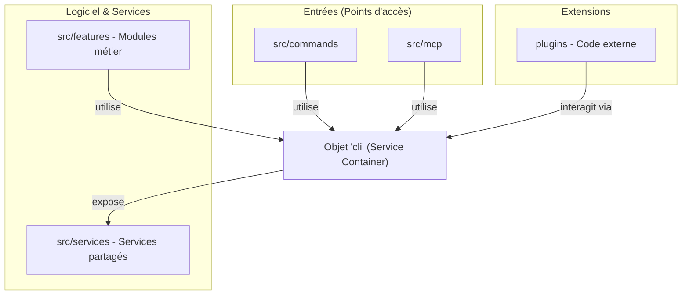

# MCLP CLI - CLI Extensible en TypeScript

**MCLP** (Model Context Language Provider) est une CLI puissante et modulaire conçue pour automatiser le développement, la génération de code (scaffolding) et l'intégration de services d'intelligence artificielle via le protocole **MCP** (Model Context Protocol).

---

## 🚀 Présentation du Projet

Ce projet est conçu comme un outil de productivité unifié. Il permet de piloter des tâches complexes (génération de code, gestion de projets) tout en étant compatible avec les agents IA via le protocole MCP. Sa modularité repose sur un système de services centralisés et de plugins extensibles.

---

## 🏗️ Structure Technique

Le projet repose sur un pattern de **Service Container (Registry)**. Un objet central `cli` regroupe l'ensemble des services de l'application (FileSystem, Logger, Config, etc.) et les injecte dans les commandes et fonctionnalités.

### Schéma de Fonctionnement



### Organisation Modulaire
- **Service Container** : L'objet `cli` assure l'inversion de contrôle et facilite le partage des ressources techniques.
- **Vertical Slices (Features)** : Les fonctionnalités métier sont regroupées par domaine dans `src/features`, favorisant la cohésion.
- **Plugins** : Le système permet d'étendre dynamiquement les capacités de la CLI sans modifier le noyau.

---

## 📂 Arborescence du Projet

```text
.
├── .cli-local/             # Configuration et données locales
├── .doc/                   # Documentation technique détaillée
├── plugins/                # Plugins (générateurs, outils)
├── src/                    # Code source principal
│   ├── commands/           # Définition des commandes CLI
│   ├── context/            # Construction du conteneur de services
│   ├── core/               # Initialisation de l'application
│   ├── features/           # Modules métier (project, scaffolders, etc.)
│   ├── mcp/                # Serveur Model Context Protocol
│   ├── services/           # Implémentations des services techniques
│   └── types/              # Modèles et contrats d'interfaces
└── tests/                  # Tests automatisés
```

---

## ⚙️ Démarrage Rapide

### Installation
```bash
npm install
npm run build
```

### Commandes Utiles
- `mclp tree` : Analyse et affiche la structure des dossiers.
- `mclp mcp start` : Démarre le serveur pour les IA.
- `npm run dev` : Mode développement avec auto-rechargement.

---

## 📄 Plus d'informations
Pour une analyse plus détaillée de l'organisation interne, consultez [Structure Technique](.doc/architecture/structure-technique.md).
